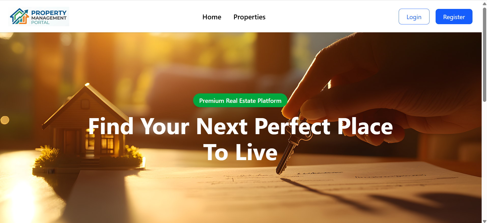
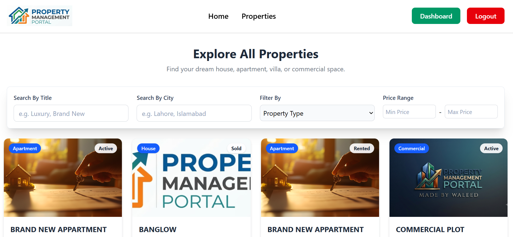
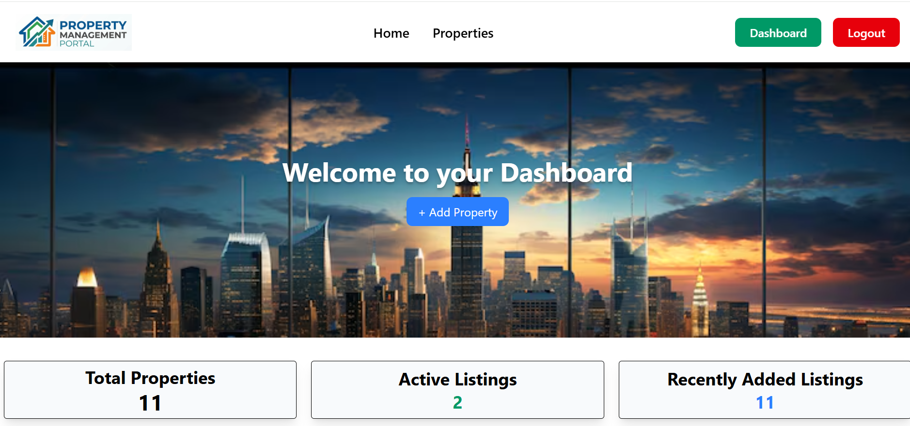
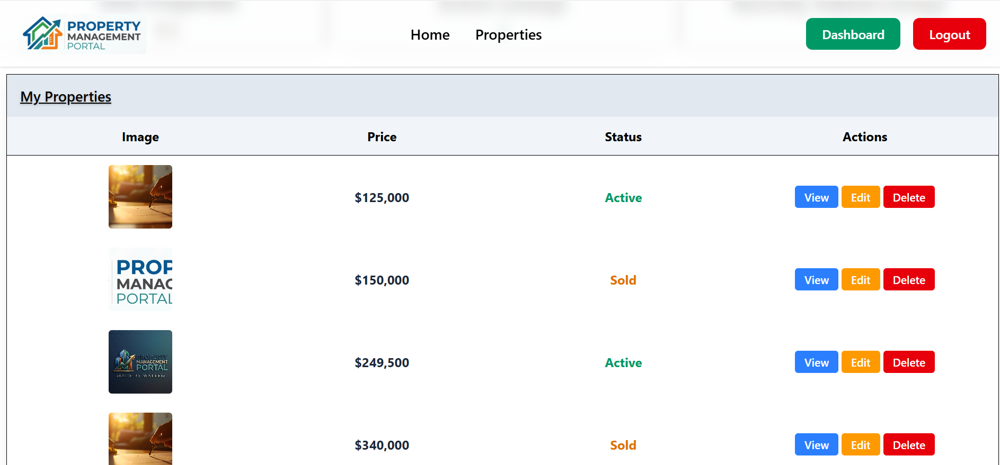

# 🏢 Property Management Portal

A modern, full-stack real estate and property management application designed to seamlessly list, browse, and manage properties. Built with **React (Vite)** on the frontend and **Node.js, Express, and MongoDB** on the backend.

---

## 📸 Screenshots

| Homepage | Properties List |
| :---: | :---: |
|  |  |

| Dashboard Overview | Property Management |
| :---: | :---: |
|  |  |

---

## ✨ Features

- 🔐 **Authentication**: Secure User Registration and Login using JWT and Bcrypt password hashing.
- 🏠 **Property Listings**: Browse real estate listings with high-resolution image galleries, pricing, and locations.
- 📊 **User Dashboard**: Manage your own properties (Create, View, Edit, and Delete).
- 🖼️ **Image Uploads**: Upload property images powered by Express & Multer middleware.
- 🎨 **Modern Responsive UI**: Built with React 19, Tailwind CSS v4, and React Toastify notifications.

---

## 🛠️ Tech Stack

### **Frontend**
- **Framework**: React 19 (via Vite)
- **Styling**: Tailwind CSS v4
- **Routing**: React Router v7
- **HTTP Client**: Axios
- **Notifications & Icons**: React Toastify, React Icons

### **Backend**
- **Runtime**: Node.js
- **Framework**: Express 5
- **Database**: MongoDB (via Mongoose ORM)
- **Auth & Security**: JSON Web Tokens (JWT), Bcrypt password hashing
- **File Storage**: Multer
- **Validation**: Joi

---

## 🚀 Getting Started

Follow these step-by-step instructions to clone, configure, and run the project locally.

### Prerequisites

Make sure you have the following installed on your system:
- [Node.js](https://nodejs.org/) (v18 or higher recommended)
- [npm](https://www.npmjs.com/) (comes with Node.js)
- [MongoDB](https://www.mongodb.com/) (Running locally or a MongoDB Atlas URI)

---

### 1️⃣ Clone the Repository

```bash
git clone https://github.com/your-username/Property-Management-Portal.git
cd "Property Management Portal"
```

---

### 2️⃣ Backend Setup (`Server`)

1. Open terminal and navigate to the backend directory:
   ```bash
   cd Server
   ```

2. Install backend dependencies:
   ```bash
   npm install
   ```

3. Set up environment variables:
   Create a `.env` file in the `Server` folder (or copy `.env.example`):
   ```bash
   cp .env.example .env
   ```
   Add the following values inside `.env`:
   ```env
   PORT=8000
   MONGO_DB=mongodb://localhost:27017/property_management
   JWT_SECRET=your_secret_key_here
   ```
   > ⚠️ **Important**: Ensure `PORT=8000` as the frontend application communicates with `http://localhost:8000`.

4. Start the backend development server:
   ```bash
   npm run dev
   ```
   *The server will run on `http://localhost:8000`.*

---

### 3️⃣ Frontend Setup (`client`)

1. Open a **new terminal window/tab** and navigate to the client directory:
   ```bash
   cd client
   ```

2. Install frontend dependencies:
   ```bash
   npm install
   ```

3. Start the Vite development server:
   ```bash
   npm run dev
   ```

4. Open your browser and navigate to:
   ```text
   http://localhost:5173
   ```

---

## 📁 Project Structure

```text
Property Management Portal/
├── client/                 # React + Vite Frontend
│   ├── public/             # Static public assets
│   ├── src/
│   │   ├── components/     # Reusable UI components (Navbar, Cards, Forms, Modals)
│   │   ├── pages/          # App pages (Home, Properties, Dashboard, Login, Register)
│   │   ├── App.jsx         # React Router setup
│   │   └── main.jsx        # App entry point
│   ├── package.json
│   └── vite.config.js
│
├── Server/                 # Node.js + Express Backend
│   ├── config/             # Database connection setup
│   ├── controllers/        # Route logic (Auth, Property)
│   ├── middlewares/        # Auth & validation middlewares
│   ├── models/             # Mongoose schemas (User, Property)
│   ├── routes/             # API routes
│   ├── uploads/            # Stored property images
│   ├── .env.example        # Environment variables template
│   ├── index.js            # Express server entry point
│   └── package.json
│
└── screenshots/            # Application screenshot previews
```

---

## 🔗 API Endpoints Summary

| Method | Endpoint | Description | Auth Required |
| :--- | :--- | :--- | :---: |
| `POST` | `/register` | Register a new user account | ❌ |
| `POST` | `/login` | User authentication & token issuance | ❌ |
| `GET` | `/api/property/allproperties` | Get all public property listings | ❌ |
| `GET` | `/api/property/myproperties` | Get properties listed by authenticated user | ✅ |
| `POST` | `/api/property/addproperty` | Create a new property listing with image upload | ✅ |
| `PUT` | `/api/property/editproperty/:id` | Update an existing property listing | ✅ |
| `DELETE` | `/api/property/deleteproperty/:id` | Delete a property listing | ✅ |

---
